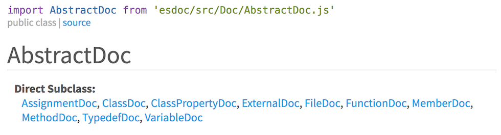
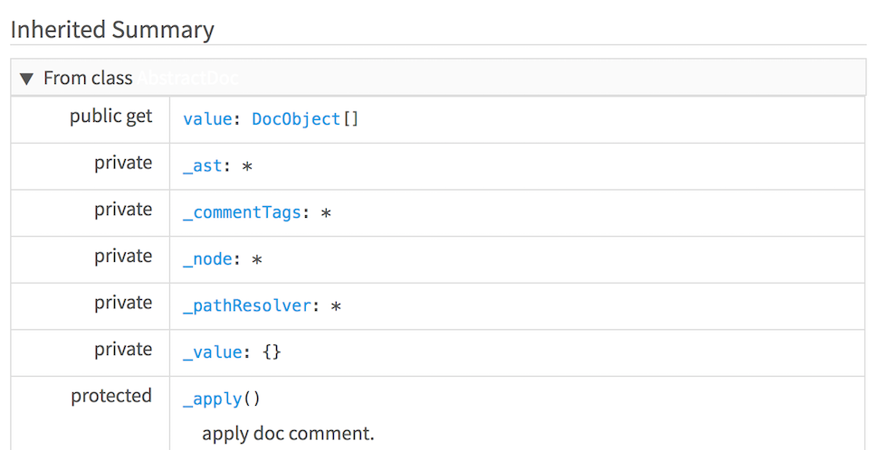
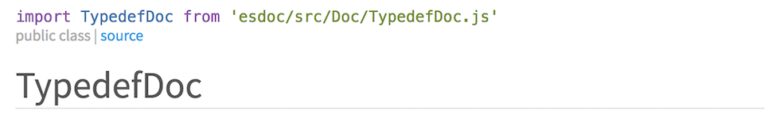
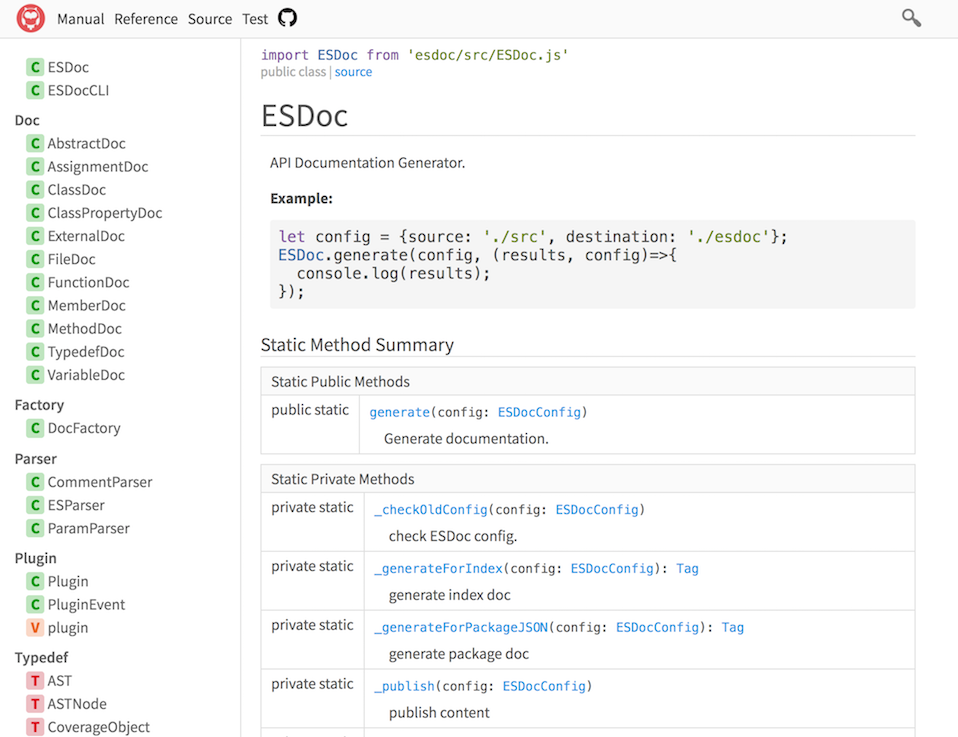
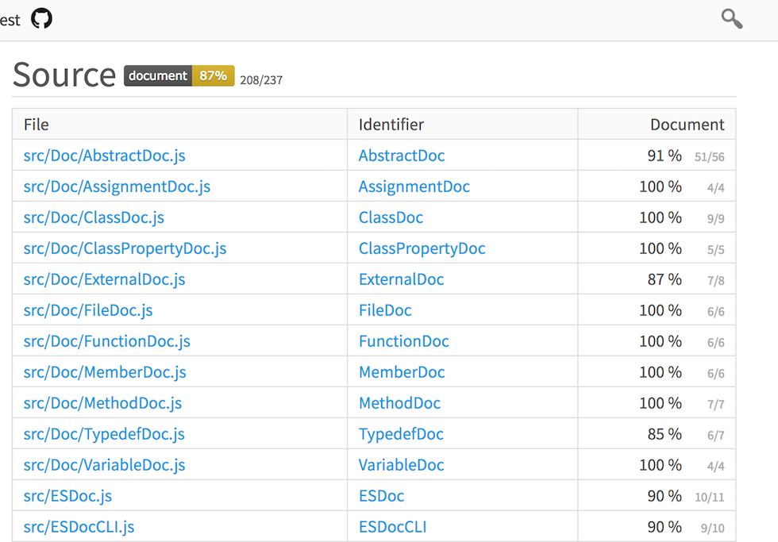
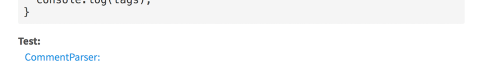
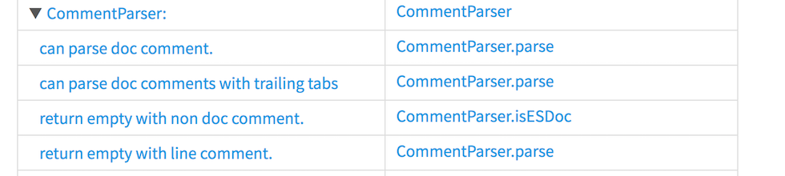
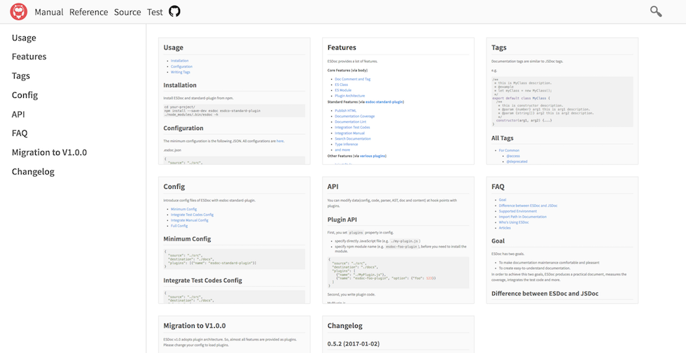
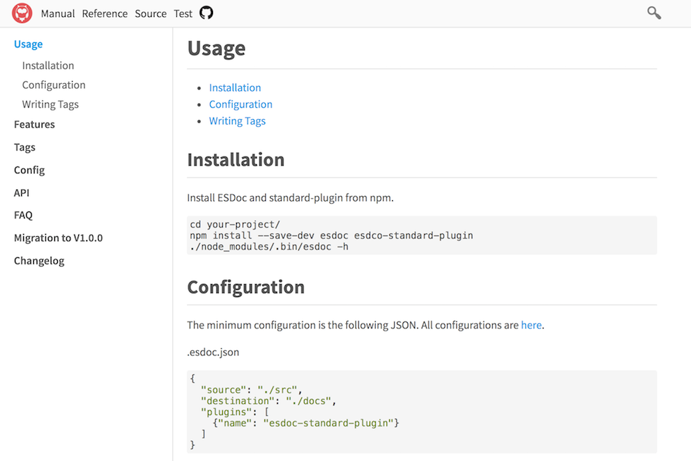

# Features

esdoc2 provides a lot of features.

**Core Features (via body)**
- [Doc Comment and Tag](#doc-comment-and-tag)
- [ES Class](#es-class)
- [ES Module](#es-module)
- [Plugin Architecture](#plugin-architecture)

**Standard Features (via [esdoc2-standard-plugin](https://github.com/esdoc2/esdoc2-plugins/tree/master/esdoc2-standard-plugin))**
- [Publish HTML]()
- [Documentation Coverage](#documentation-coverage)
- [Documentation Lint](#documentation-lint)
- [Integration Test Codes](#integration-test-codes)
- [Integration Manual](#integration-manual)
- [Search Documentation](#search-documentation)
- [Type Inference](#type-inference)
- [and more](https://github.com/esdoc2/esdoc2-plugins/tree/master/esdoc2-standard-plugin)

**Other Features (via [various plugins](https://github.com/esdoc2/esdoc2-plugins))**
- [Inject Style](https://github.com/esdoc2/esdoc2-plugins/blob/master/esdoc2-inject-style-plugin)
- [Inject Script](https://github.com/esdoc2/esdoc2-plugins/tree/master/esdoc2-inject-script-plugin)
- [ECMAScript Proposal](https://github.com/esdoc2/esdoc2-plugins/tree/master/esdoc2-ecmascript-proposal-plugin)
- [Flow](https://github.com/esdoc2/esdoc2-plugins/blob/master/esdoc2-flow-type-plugin) [PoC]
- [TypeScript](https://github.com/esdoc2/esdoc2-plugins/blob/master/esdoc2-typescript-plugin) [PoC]
- [JSX](https://github.com/esdoc2/esdoc2-plugins/blob/master/esdoc2-jsx-plugin)
- [React](https://github.com/esdoc2/esdoc2-plugins/blob/master/esdoc2-react-plugin) [PoC]
- [Publish Markdown](https://github.com/esdoc2/esdoc2-plugins/blob/master/esdoc2-publish-markdown-plugin) [PoC]
- [and more](https://github.com/esdoc2/esdoc2-plugins)

## Doc Comment and Tag
esdoc2 obtains a comment called `doc comment` from a source code. <br/>
Then esdoc2 generates a document from a `tag` in a `doc comment`.

A `doc comment` is block comment beginning with `*`. A `tag` is a text of the form `@tagName`.

```javascript
/**
 * This is Foo.
 */
export default class Foo {
  /**
   * @param {number} p - this is p.
   */
  method(p){}
}
```

## ES Class
esdoc2 supports ES class syntax and targets codes that are written by it.

ES class syntax makes the clear relation of class, method, member, constructor and inheritance.<br/>
This means that esdoc2 can generate a document without using a tag for these. In other words, you don't need to write tags for classes.

esdoc2 automatically generates the under contents by class syntax.

- Super classes
- Direct Subclasses and Indirect Subclasses.
- Inherited methods and members from super class.
- Override methods and members from super class.





Note: esdoc2 doesn't support prototype base codes and function base codes.

## ES Module
esdoc2 supports ES modules syntax and targets codes that are written by it.<br/>
ES modules syntax is file base. So esdoc2 treats as one file = one module.

esdoc2 displays a import style in accordance with the export style.

- If `export default class Foo{}`, displays `import Foo from './Foo.js'` in `Foo` class documentation.
- If `export class Foo{}`, displays ``import {Foo} from './Foo.js'``in `Foo` class documentation.

This is useful because you not need to see export style in source code.



And you may as well as use [esdoc2-importpath-plugin](https://github.com/esdoc2/esdoc2-plugins/tree/master/esdoc2-importpath-plugin) to transform path.

Note: esdoc2 doesn't support commonjs.

## Plugin Architecture
esdoc2 adopts plugin architecture. So, almost all features are provided as plugins.

Especially [esdoc2-standard-plugin](https://github.com/esdoc2/esdoc2-plugins/tree/master/esdoc2-standard-plugin) is a packaging plugin with major plugins.<br/>
Normally we recommend using this plugin. There are various plugins in [esdoc2/esdoc2-plugins](https://github.com/esdoc2/esdoc2-plugins).

You can easily make plugins, and there are many [third party plugins](https://www.npmjs.com/search?q=esdoc2%20plugin&page=1&ranking=optimal).<br/>
Please click [here](./api.html) for how to make plugins.

## Publish HTML
esdoc2 generates HTML documents that are easy to see and plain looks.



## Documentation Coverage
esdoc2 inspects a documentation coverage. This is useful information for the following.

- This leads the motivation of documentation.
- This inspects a missing of documentation.

esdoc2 processes only top-level class, function and variable.<br/>
This is based on, esdoc2 measures coverage by how much the document is being written out of all the processing target.<br/>
And, esdoc2 is also to measure coverage of each module, you will have become easier to also find a missing of the document.

For example, [this](https://doc.esdoc2.org/github.com/esdoc2/esdoc2/source.html) is coverage of esdoc2 itself.



## Documentation Lint
If documentation is invalid, esdoc2 shows warning log.

```javascript
export default class Foo {
  /**
   * @param {number} x
   */
  method(p){}
}
```


Note: For now, esdoc2 lints only method/function signature.

## Integration Test Codes
Test codes are important information.<br/>
So, esdoc2 generates a cross reference of test codes and document.

```javascript
/** @test {MyClass} */
describe('MyClass is super useful class.', ()=>{

  /** @test {MyClass#sayMyName} */
  it('say my name', ()=>{
    let foo = new MyClass('Alice');
    assert.equal(foo.sayMyName(), 'My name is Alice');
  })
});
```





## Integration Manual
You can integrate a manual of a your project into documentation.

```
# Overview
This is my project overview.
...
```





## Search Documentation
esdoc2 supports built-in searching in document with only JavaScript(without server implementation).

The implementation of searching:

- esdoc2 made the index(JSON) at the time of document generation.
- The user search from the index.


Note: This implementation is very naive. There might be a problem in search performance. For now, no problem in 500 indexes.

## Type Inference
esdoc2 infers type of variables using codes if those have no `@param`.

The following variables are supported.
- A class type using class syntax.
- A method/function arguments type using default argument syntax.
- A property type using assignment value.
- A return type using return value.

Note: This implementation is very simple. So esdoc2 infers only primitive values(number, boolean, string).
